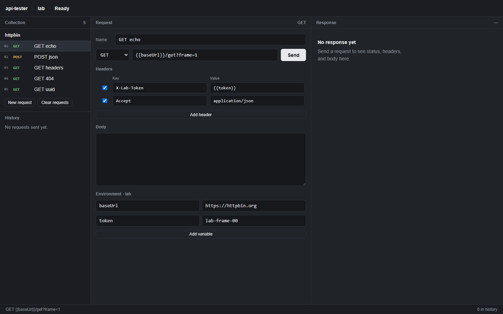

# api-tester

Dense HTTP workbench: collections on the left, the request in the middle, a hex-ish JSON dump on the right. Cyan on charcoal, IBM Plex Sans Condensed + Fira Code — a Wireshark / mainframe bench, not a purple client.

Seeded with an **httpbin** collection (`{{baseUrl}}` → `https://httpbin.org`). Headers and the URL interpolate `{{env}}` tokens. History keeps the last 40 exchanges in `localStorage`.

## Run

```bash
npm install
npm run dev
```

Open the URL Vite prints (usually http://localhost:5173). You should see three panes: **httpbin** frames, a GET echo editor, and an empty dump until you hit **Send**.

```bash
npm run build
npm run preview
```

## Notes

- `GET 404` is in the seed so you can watch a failed status in the dump pane.
- **Drop frames** clears the capture; **Reload httpbin** restores the seed.
- Unresolved `{{tokens}}` stay on the bench — they never fire a half-built request.


